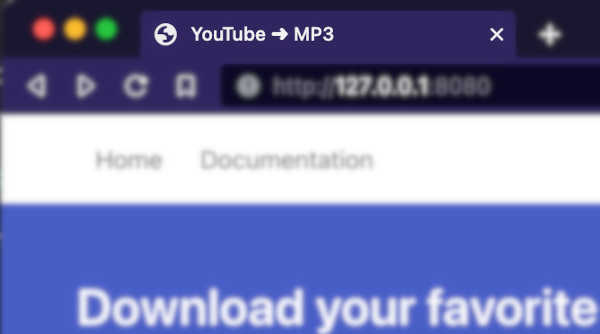

# DISCLAIMER
**This document is a work in progress**

---

# Apps (or Services)

The project is uses a microservices architecture. What are microservices?, to put in simple terms a microservice is a small piece of a bigger system that usually does one thing and one thing only.

> To know more about microservices, read these articles
> 
> @TODO add articles

# Web Service (web folder)

This is where our frontend and backend API resides.

### Frontend

The frontend is the what the user sees and is built using HTML, CSS and Javascript.

> If you're new to HTML, CSS and Javascript:
> 
> @TODO Mozilla guides

In our case we're using a CSS Framework, called [Bulma](https://bulma.io/documentation/).

> A CSS framework is a library allowing for easier, more standards-compliant web design using the Cascading Style Sheets language. Most of these frameworks contain at least a grid. More functional frameworks also come with more features and additional JavaScript based functions, but are mostly design oriented and focused around interactive UI patterns.
>   
> Source: https://en.wikipedia.org/wiki/CSS_framework

What I like about **Bulma** is that it's nice option for people that are getting started and documentation is quite good.

Once you understand the basics behind one CSS Framework, you can easily jump into a new one quite easy.

I recommend that you start by skimming the docs to have a rough idea on what's all about: [https://bulma.io/documentation/overview/start/](https://bulma.io/documentation/overview/start/)

#### The index file

Open the file at `app/web/templates/index.html` with your favourite code editor.

This is the *main page* of our application, where our users can paste a **youtube link** and send it to our backend to be converted into a mp3 file.

To better understand it, let's start by analysing each section in this file.

##### The head

```
<!DOCTYPE html>
<html>
  <head>
    <meta charset="utf-8">
    <meta name="viewport" content="width=device-width, initial-scale=1">
	 <title>YouTube ➜ MP3</title>
    <link rel="stylesheet" href="https://cdn.jsdelivr.net/npm/bulma@0.9.4/css/bulma.min.css">
  </head>
  <body>
```

A standard HTML head section. The most relevant parts here are the **title** and **link** tags

`<title>YouTube ➜ MP3</title>`  
This is what you see in your browser tab when you open the tab



`<link rel="stylesheet" href="https://cdn.jsdelivr.net/npm/bulma@0.9.4/css/bulma.min.css">`  
This tells the browser to load **Bulma CSS Framework** when the page is open.

> You don't need to have **Bulma** in your computer/server to use it, you can *serve it* directly from their CDN Service
> 
> What's a CDN?  
> A content delivery network (CDN) refers to a geographically distributed group of servers which work together to provide fast delivery of Internet content.
> 
> A CDN allows for the quick transfer of assets needed for loading Internet content including HTML pages, javascript files, stylesheets, images, and videos. The popularity of CDN services continues to grow, and today the majority of web traffic is served through CDNs, including traffic from major sites like Facebook, Netflix, and Amazon.  
> 
> Source: https://www.cloudflare.com/learning/cdn/what-is-a-cdn/


##### The Navegation Bar

```
<nav class="navbar">
  <div class="container">
    <div id="navMenu" class="navbar-menu">
      <div class="navbar-start">
        <a class="navbar-item">
          Home
        </a>
        <a class="navbar-item">
          Documentation
        </a>
      </div>

      <div class="navbar-end">
        <div class="navbar-item">
          <div class="buttons">
            <a class="button is-dark" href="https://github.com/gdi3d/learning-to-build">Github</a>
            <a class="button is-link" href="https://github.com/gdi3d/learning-to-build/archive/refs/heads/main.zip">Download</a>
          </div>
        </div>
      </div>
    </div>
  </div>
</nav>
```  


This is a fairly common navegation component. You can do a lot of customization if you need.

**But, how do you know where to get this code?** That's simple, you just need to look at **Bulma** docs: [https://bulma.io/documentation/components/navbar/](https://bulma.io/documentation/components/navbar/)

Just look for the one you need, and copy and paste into your own web code.

##### The Hero Component

```
<section class="hero is-link">
  <div class="hero-body">
    <p class="title">
      Download your favorite songs from YouTube!
    </p>
    <p class="subtitle">
      And learn how to become a web dev in the process 😎
    </p>
  </div>
</section>
```  


This is a layout from **Bulma** called *Hero*. Here are the docs: [https://bulma.io/documentation/layout/hero/](https://bulma.io/documentation/layout/hero/)

Again, you can look trough the examples and options and just copy and paste what you need.

You can start seeing a pattern here, you can build a lot of stuffs by just copying and pasting. It's all about **the building blocks** like a Lego. You just need to choose the pieces and colours to build your own cool project.

> The names of components, layouts and other building blocks are the same in every CSS Frameworks.

##### The main section

```
<section class="section is-large has-background-dark">
  <h1 class="title has-text-white-ter">Paste the YouTube video link here</h1>
  <div>
    <div class="field is-grouped">
      <p class="control is-expanded">
        <input class="input is-large" name="video_url" type="text" placeholder="https://www.youtube.com/watch?v=dQw4w9WgXcQ">
      </p>
      <p class="control">
        <button class="button is-info is-large" id="convert">
          Download as MP3
        </button>
      </p>
    </div>
  </div>
  
  <div class="columns mt-1 is-hidden" id="convert_success">
    <div class="column is-8 has-text-centered is-offset-1">
      <div class="notification is-success">
        <p class="is-size-4">The video is being converted 🥳 &dash; <a id="mp3_download_link">Click here to download the file</a></p>
      </div>
    </div>
  </div>

  <div class="columns mt-1 is-hidden" id="convert_error">
    <div class="column is-8 has-text-centered is-offset-1">
      <div class="notification is-danger">
        <p class="is-size-4">Oh no!, something went wrong! 🙃</p>
      </div>
    </div>
  </div>

</section>
```
Here's where our user is going to paste the YouTube URL that wants to convert into an **MP3**.

There's a few things to unpack here, but again, everything has been copied and pasted from **Bulma** with minors modifications.

```
<section class="section is-large has-background-dark">
....
</section>
```

The section **layout** is the **Large** option in **Bulma** docs: [https://bulma.io/documentation/layout/section/](https://bulma.io/documentation/layout/section/), and you can tell by looking at one of the *classes* in the **class** attribute: `class="section is-large** has-background-dark"`, the one that's named `is-large` indicates the height of the *section*

> What's a section???
> 
> The \<section\> HTML element represents a generic standalone section of a document, which doesn't have a more specific semantic element to represent it. Sections should always have a heading, with very few exceptions.
> 
> Source: https://developer.mozilla.org/en-US/docs/Web/HTML/Element/section

Inside the **section** we have the input field and a button.

```
<div>
  <div class="field is-grouped">
    <p class="control is-expanded">
      <input class="input is-large" name="video_url" type="text" placeholder="https://www.youtube.com/watch?v=dQw4w9WgXcQ">
    </p>
    <p class="control">
      <button class="button is-info is-large" id="convert">
        Download as MP3
      </button>
    </p>
  </div>
</div>
```


You can see that the input and button where taken from: [https://bulma.io/documentation/form/general/#form-group](https://bulma.io/documentation/form/general/#form-group) (the 4th example)

And then two *hidden* elements. You can tell they are hidden because of the *classes* in the *class* attribute is named **is-hidden**

The success notification
```
<div class="columns mt-1 is-hidden" id="convert_success">
  <div class="column is-8 has-text-centered is-offset-1">
    <div class="notification is-success">
      <p class="is-size-4">The video is being converted 🥳 &dash; <a id="mp3_download_link">Click here to download the file</a></p>
    </div>
  </div>
</div>
```


And the error notification

```
<div class="columns mt-1 is-hidden" id="convert_error">
  <div class="column is-8 has-text-centered is-offset-1">
    <div class="notification is-danger">
      <p class="is-size-4">Oh no!, something went wrong! 🙃</p>
    </div>
  </div>
</div>
```

