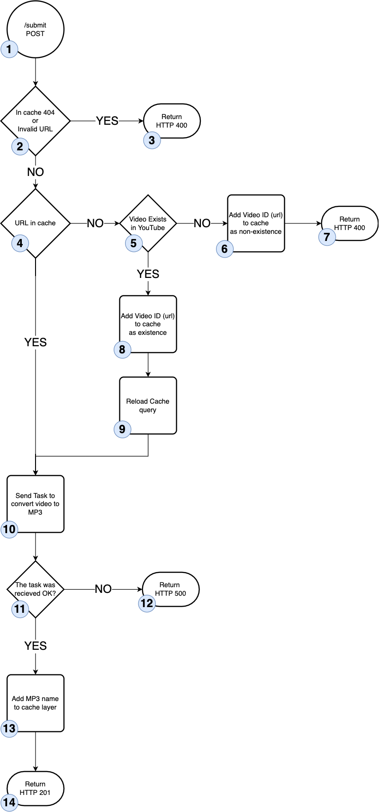
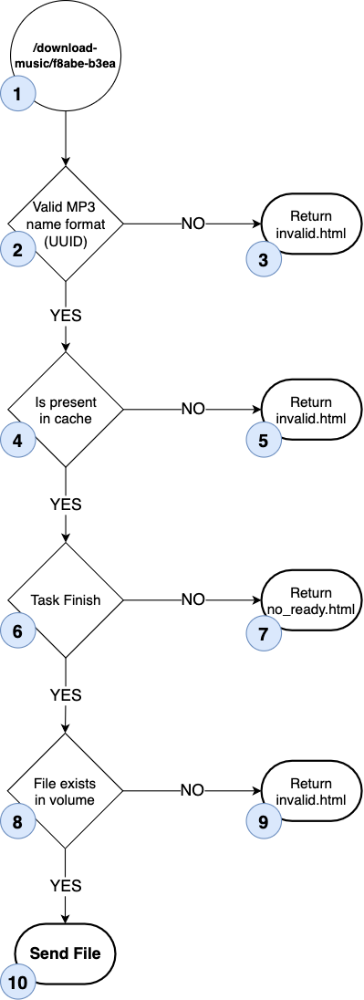
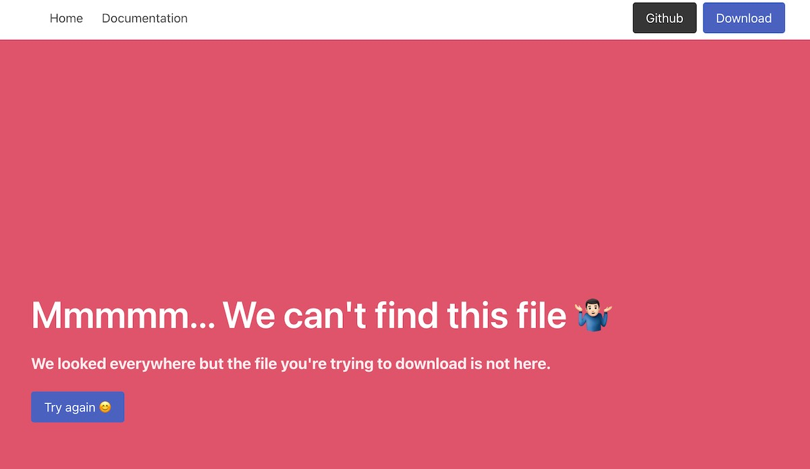
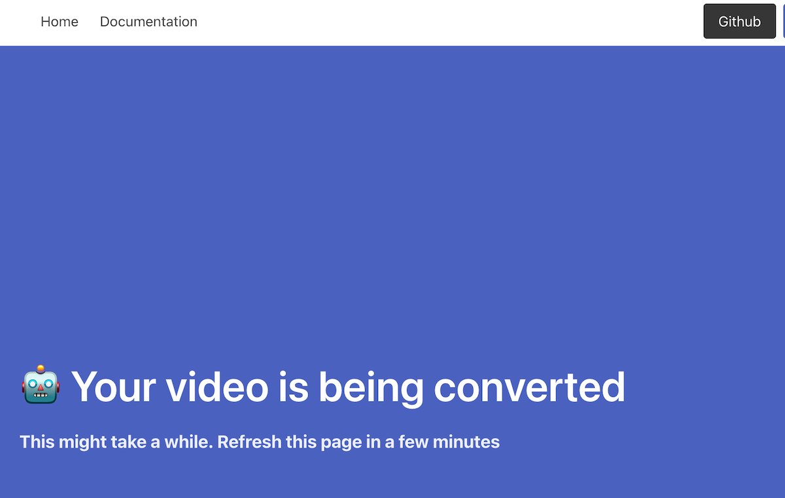

# Showing the Index File

As mentioned in the [Getting Started](/README?id=what39s-it-about) the backend is built using [Flask Framework](https://flask.palletsprojects.com/en/2.1.x/)

If you're new to Flask o Frameworks please take a moment to read the documentation since I won't go into details about this subject.

## The Home / Index URL

Start by opening the file at `app/web/main.py`

You'll see a few *imports*, *variables* and then you'll see this code

```python
@app.route('/', methods=["GET"])
def home():
    return render_template('index.html')
```

This is what gets executed when you open the web at [http://127.0.0.1:8080/](http://127.0.0.1:8080/)

!> Remember that http://127.0.0.1:8080 means that you are running the code on your machine (localhost)

> See the section **How to use it** first at [Getting Started](/README)

The first line, it's called a [decorator](https://www.programiz.com/python-programming/decorator) and creates a **route** (an URL address) that when visited triggers the function **home()** in our example.

!> You can use any name on the function. It has no relationship with the URL address.

The first argument that this function takes is `/`. That's the route we want to define. This is the *home* or *index* of the web.

The second parameter is `methods=["GET"]`. This is related to how requests can be made to an URL. We just want to allow GET requests because we only need to show the **index.html** and nothing more.

> About HTTP methods: [https://developer.mozilla.org/en-US/docs/Web/HTTP/Methods](https://developer.mozilla.org/en-US/docs/Web/HTTP/Methods)

And to show the **index.html** we use the function `render_template`. 

We're using the [template system](https://flask.palletsprojects.com/en/2.1.x/quickstart/#rendering-templates) that comes with **Flask** to process our **index.html** and returning it to the browser.

### Comments

In this case, our backend only acts as a **Web Server** since we're only showing an HTML file.

We could replace that code and use for example [Nginx](https://nginx.org/en/) to serve the **index.html**.

By doing so, we could use our backend to act as a *pure* [Rest API](https://www.ibm.com/cloud/learn/rest-apis) 

But for learning purposes, the current design works just fine.

--- 

# Receiving the YouTube Link

Our fronted doesn't do a lot of things, it just needs to receive a **YouTube** URL and send it to our backend.

We've already seen how this is done in [The Frontend](/app/frontend?id=javascript) **Javascript** section.

## Backend Endpoint

!> What's an endpoint? It's a fancy way to call URL's in the context of [REST API's](https://www.ibm.com/cloud/learn/rest-apis)

In our application, this endpoint is `http://127.0.0.1:8080/submit` 

Open the file at `app/main.py` and look for the code that starts with `@app.route('/submit', methods=["POST"])`

Let's see the first two lines

```python
@app.route('/submit', methods=["POST"])
```

We use the *route* decorator to define our endpoint and we're only going to accept requests of type **POST**.

!> Remember a *route* is what allows us to create a URL for our users to use.

```python
request_data = request.get_json()
```

We need to talk about the **request** object.

> You can read the docs here: [https://werkzeug.palletsprojects.com/en/2.2.x/wrappers/#werkzeug.wrappers.Request](https://werkzeug.palletsprojects.com/en/2.2.x/wrappers/#werkzeug.wrappers.Request) 

This *object* has all the information that the browser sends when the user makes the request to the endpoint.

> Translation: When the user hits the button **Convert to MP3** in our frontend, the javascript function associated with that button sends an HTTP Request to our endpoint `http://127.0.0.1:8080/submit` with the link that the user wants to convert to MP3 and some extra information that the browser *always* sends by default.

In our project, we're only interested in the *payload* sent by the javascript file. 

That's the `const data = ...` in the first line.

```js
const data = { video_url:  document.getElementsByName('video_url')[0].value };

fetch('http://127.0.0.1:8080/submit', {
    method: 'POST',
    headers: {
      'Content-Type': 'application/json',
    },
    body: JSON.stringify(data),
  })
  ....
```

As you can see, the `body` is our `payload`. These two words are interchangeable but most of the time we use the word *payload* to talk about the information needed by the endpoint to work.

To access the *payload* in our backend, we use `request.get_json()` and that's because the data in the *payload* is encoded in [JSON](https://developer.mozilla.org/en-US/docs/Web/JavaScript/Reference/Global_Objects/JSON) format.

!> That's what the line `JSON.stringify(data)` does in the javascript file. It encodes the javascript object *const data* into a JSON

## About The Cache Layer

Before we start analyzing the flowchart, we need to talk about the cache layer.

We're using a cache layer in our backend to do a few things.

But what's a cache? A cache solution to store frequently accessed data somewhere to improve performance by avoiding accessing it directly from the source.

In our project, the cache layer is built using **[Redis](https://redis.io/)**, an *in-memory* database.

**Redis** is a *key-value* database. This means that you only have two fields:

- Key: An index, like a variable, where you store information
- Value: The data that you want to store

```python
redis_connection.set('video_id', 'p9kdDet7G14')            
```

In this example we are storing the value **p9kdDet7G14** inside the key **video_id**

The cool thing about having an *in-memory* database is that it's super fast.

The bad thing is that you need *memory*, RAM to be more precise, and that should be taken into account.

In most cases, **Redis** will be running in a separate machine so the RAM is fully dedicated to the service.

Now that you know a little bit more about Cache and **Redis**, you might be wondering why and where are we using them. 

**Why?** Because we want to reduce the number of calls we make to YouTube to check if a video exists or not.

**Where?** Every time a new video is sent to our backend, and also to track the status of our **convert to mp3** task.

This is useful when you have a lot of traffic since there are more chances to have a *cache hit* in that scenario.

> This project is only for learning, but cache layer design is quite common in systems with high volume traffic and it's something you should take into consideration when you're designing your app.

## Flowchart



*The numbers in the flowchart don't necessarily indicate steps, it is just for making the documentation easier*

### 1 The Entrypoint

Our frontend, as mentioned above, will be sending the information to the endpoint `/submit`

### 2 Check Valid URL and Cache Layer

We make two checks here:

**Check if the video is cached**

If the video ID (Ex.: Given https://www.youtube.com/watch?v=p9kdDet7G14, the video ID is *p9kdDet7G14*) is already present in the cache and with a value has. If it's 404, it means that the video doesn't exist on YouTube.

**Is a valid YouTube Video?**

Check if the URL given is a valid YouTube URL.

If one of these conditions is **TRUE**, jump to **[3 Return Error](/app/backend?id=_3-return-error)**

If the result is **FALSE**, jump to **[4 URL in cache](/app/backend?id=_4-url-in-cache)**

### 3 Return Error

Abort the process and return an error with HTTP 400.

The javascript will see that and show an error to the user.

!> Check [The Frontend](/app/frontend?id=javascript) **Javascript** section

### 4 URL in cache

The URL, or video ID to be precise, is present on the cache?

- If **True** (*cache hit*), jump to 10
- If **False**, jump to 5

### 5 Video exists on YouTube

We make a call to the **YouTube Thumbs** service 

```python
video_thumb = requests.get('https://img.youtube.com/vi/{v_id}/0.jpg'.format(v_id=video_id))
```

This is a *hack* to check if a video exists or not on **YouTube**

If it does exist, we jump to **[8 Video Exists](/app/backend?id=_8-video-exists)**, if not, we jump to **[6 Store in Cache non-existing Video ID](/app/backend?id=_6-store-in-cache-non-existing-video-id)**

### 6 Store in Cache non-existing Video ID

Since the video doesn't exist on **YouTube** and we want to reduce the number of calls we make. We store the video ID in the cache.

```python
rc.set(settings.CACHE_VIDEO_ID_KEY.format(vid=video_id), settings.CACHE_VIDEO_ID_DONT_EXISTS_CODE)
```

Where `settings.CACHE_VIDEO_ID_KEY` is the *key* we use to identify the record on **Redis** 

!> `CACHE_VIDEO_ID_KEY = "ve_{vid}"` from file `app/web/settings.py`

And if we replace the variable, it would look like this

```python
# Given URL https://www.youtube.com/watch?v=p9kdDet7G14

rc.set("ve_{vid}".format(vid= p9kdDet7G14), '404')

# or fully replaced
rc.set("ve_p9kdDet7G14", '404')
```

### 7 Return Error

Since the video doesn't exist, we need to return an error.

```python
return APIResponse(
    data={},
    message="Video doesn't exists",
    message_code="VIDEO_DONT_EXISTS",
    http_code=400
)
```

This will be caught by our javascript function as described on the [The Frontend](/app/frontend?id=javascript) **Javascript** section.

### 8 Video Exists

Now we know that the video exists (this happened in **[5 Video exists on YouTube](/app/backend?id=_5-video-exists-on-youtube)**), we store the video ID in our cache layer and flag it as an existent video.

```python
rc.set(settings.CACHE_VIDEO_ID_KEY.format(vid=video_id), settings.CACHE_VIDEO_ID_EXISTS_CODE)

# Or replacing variables, if the video URL is https://www.youtube.com/watch?v=p9kdDet7G14 

rc.set("ve_p9kdDet7G14", '200')
```

### 9 Reload our cache values

At this point, we've added a new entry to our cache layer. 

This means that we need to update the variable that stores information about our cache status.

### 10 Send an asynchronous task to create the MP3

Our code uses **[Celery](https://docs.celeryq.dev/en/stable/index.html)** to help us create **Tasks** that run *decoupled* from our main code. 

This allows us to create a scalable and efficient app. 

!> We will talk more about celery later on.

At this stage, we call our **Celery Task** and send the video URL that we want to download and convert to MP3. 

This process *schedules* a task and the task might not run right away since it's attached to a *queue* with a pool of *workers* (functions).

The *workers* in that pool might be running other **Tasks**, but once a *worker* is released our request will be processed.

### 11 Check if Task has been enqueued

If the **scheduling** process is successful, we store it in our cache (**[13 Add the MP3 name to the cache layer](/app/backend?id=_13-add-the-mp3-name-to-the-cache-layer)**).

### 12 Unable to schedule the task

If something went wrong, we return an error. 

The javascript function will show that error to the user.

### 13 Add the MP3 name to the cache layer

Store the name that the MP3 file will have once is finished

```python
cache_key = mp3_name
rc.setex(cache_key, settings.CACHE_DEFAULT_TTL, settings.TASK_QUEUED_STATUS_CODE)
```

Notice the variable `settings.CACHE_DEFAULT_TTL` and the use of `rc.setex`. 

What this does is set an expiration time for the key. Meaning that after *N* seconds that key will be automatically deleted from our cache.

But why?, Imagine that the **task** fails and we can't create that MP3. We don't want that key to exist forever in our cache. 

So if after `settings.CACHE_DEFAULT_TTL` (set to 1 hour) the mp3 is not created, that key will be deleted and when the user tries to download the file, we can tell the user to try again.

### 14 Return 201

The request has been made and everything is ok. 

The javascript will tell the user where the mp3 will be available in a few minutes. 

---

# Download the MP3 file

The process that converts the video into an MP3 is done using a **Celery Task** and as we [mentioned here](/app/backend?id=_10-send-an-asynchronous-task-to-create-the-mp3), this **Task** runs asynchronously. 

!> Read [about Celery](/app/converting-youtube-video-to-mp3-celery)

This means that when the user clicks on **Click here to download the file**, the file might not be ready yet.


Start by opening the file at `app/web/main.py` and find these lines

```python
@app.route('/download-music/<video_to_mp3_id>', methods=["GET"])
def download(video_to_mp3_id):
```

You can see that the *route* decorator here has a new format compared to the [index one](/app/serving-index-file?id=the-home-index-url).

!> Remember a *route* is what allows us to create a URL for our users to use.

We want to be able to *receive* the name of the MP3 file that was generated, by our code, after the user clicked the **Convert to MP3** button.

Here's how the endpoint is formed for the **URL** `https://127.0.0.1:8080/download-music/c3f044e1`

- Endpoint: `/download-music/c3f044e1`
- The variable `<video_to_mp3_id>` get assigned the value `c3f044e1`


## The Flowchart Analysis



!> Keep the file `app/web/main.py` open and read along, the comments in the file will guide you trough

### 1 User asks for the file

As mentioned above, this endpoint is the one the user will use to download the MP3, and the name of the file has been already created by our backend right after the **Convert to MP3** button was clicked.

### 2 Is the MP3 name valid

To generate the name of the MP3 we use a [UUID](https://en.wikipedia.org/wiki/Universally_unique_identifier) string that looks like this

`c3f044e1-1e66-4a52-be7d-6e344fb6aec6`

!> A universally unique identifier is a 128-bit label used for information in computer systems. The term globally unique identifier is also used. When generated according to the standard methods, UUIDs are, for practical purposes, unique

!> This is a good practice if you want to prevent naming collision (which means having duplicated filenames).

**UUID** values have a well-defined mask. This means that we can validate that only valid UUID *strings* are requested to our endpoint.

!> What's an endpoint? It's a fancy way to call URL's in the context of [REST APIs](https://www.ibm.com/cloud/learn/rest-apis). Ex.: /download-music/c3f044e1-1e66-4a52-be7d-6e344fb6aec6

If someone tries to use this endpoint like this:

```
https://127.0.0.1:8080/download-music/mysuperfile
                      ^^^^^^^^^^^^^^^^^^^^^^^^^^^ -> Endpoint
https://127.0.0.1:8080/download-music/songname.mp3
                      ^^^^^^^^^^^^^^^^^^^^^^^^^^^^ -> Endpoint
https://127.0.0.1:8080/download-music/IwillHackYou
                      ^^^^^^^^^^^^^^^^^^^^^^^^^^^^ -> Endpoint
```

We can evaluate those *MP3 names* (mysuperfile, songname.mp3, IwillHackYou) and check that are not a valid **UUID** type of strings and jump to **[3 Return invalid.html response](/app/backend?id=_3-return-invalidhtml-response)**.

!> MP3 names are assigned to the variable `video_to_mp3_id` in the *route* definition  
`@app.route('/download-music/<video_to_mp3_id>', methods=["GET"])`

Otherwise, we can jump to **[4 Check the Cache Layer](/app/backend?id=_4-check-the-cache-layer)**

### 3 Return invalid.html response

We show the **invalid.html** page located at `app/web/templates/invalid.html`



The code would not even try to locate the file. We already know that this is not valid.

### 4 Check the Cache Layer

Every time we *schedule* a **Celery Task** to convert the **YouTube** video into an MP3 we add a new record into our cache layer. 

This way we can check if the **UUID** (name of the mp3 file) belongs to a file that we are currently processing, or have ready to download.

!> This record on **Redis** has a TTL (time to live) value since we are not going to be storing the MP3 file forever.  
We talked about that in the section [Receiving the YouTube Link (13)](/app/backend?id=_13-add-the-mp3-name-to-the-cache-layer)

If the **UUID** (name of the mp3 file) is not present, it means that either the file has been deleted or never existed.

!> Remember, we use the **UUID** string as the key in our cache layer

Now, if the key doesn't exist we jump to **[5 Return invalid.html response](/app/backend?id=_5-return-invalidhtml-response)**. If it does, we jump to **[6 Task Finish](/app/backend?id=_6-task-finish)**

### 5 Return invalid.html response

As we mentioned in **[4 Check the Cache Layer](/app/backend?id=_4-check-the-cache-layer)**, if we jumped here it means that the key doesn't exist. 

So we show the **invalid.html** page located at `app/web/templates/invalid.html`


### 6 Task Finish

Remember that we *asynchronously process our video* using a **Celery Task**. This means that the *task* could be waiting for a *worker* to be free to start converting the video into MP3.

Or maybe the video is being converted when the user makes the request.

> A *worker* is a process that executes a pre-defined function and it's triggered when a new *task* is given to it.  
> Our pre-defined function is the one at `app/convert/tasks/task.py` and the function name
> 
> ```python
> @celery.task(bind=True,  
>       autoretry_for=(Exception,),  
>       retry_backoff=True,
>       max_retries=3)  
> def download_audio(self, youtube_link, output_mp3_filename):  
>   
>    save_at = '{media_dir}{filename}'.format(media_dir=settings.MEDIA_DIR, filename=output_mp3_filename)
> ...
> ```

But, how do we know this?? That's covered in [Receiving the YouTube Link](/app/backend?id=receiving-the-youtube-link)

We can ask our cache layer, built with **Redis**, to give us the content stored in the key with the name of the **UUID** (name of the MP3) and it will return two possible values: `ONQUEUE` or `FINISH`

If the value returned is `ONQUEUE` then we jump to **[7 Return not_ready.html response](/app/backend?id=_7-return-not_readyhtml-response)**.

Otherwise jump to **[8 File exists in volume](/app/backend?id=_8-file-exists-in-volume)** if it's `FINISH`

### 7 Return not_ready.html response

We inform the user that we're still converting the video



### 8 File exists in volume

Let's start with the basics. What a hell is a volume????

In your docker-compose file `docker/docker-compose.yml` we have defined two volumes

!> Read about [Designing the docker-compose.yml](/coming-soon) for more information

```
volumes:
  converted_mp3_vol:
    external: true
  redis_vol:
    external: true
```

A *volume* is like a hard drive that we can use to preserve our data. 

This is useful because the storage (hard drive) of the containers is ephemeral.

That means that if the container crashes or gets shut down, any data that you stored on it will be lost.

We can attach/link volumes to containers. In our project, we attach the volume **converted_mp3** to two of our containers: **web** and **celery_workers**.

This way every time we create a new mp3 file we can store it inside the volume. 

That way we can be sure that if anything goes wrong, we still have the mp3 files safely stored.

Now that you know a bit more about volumes, we can move forward.

At this stage of the code, we know that the file should exist, but we also know that **sometimes things fail**. 

And that's why is a good practice to **ALWAYS** check that the file exists before trying to send it.

If the file exists in the volume, we jump to **[10 Send file](/app/backend?id=_10-send-file)**, or to **[9 Return invalid.html response](/app/backend?id=_9-return-invalidhtml-response)** if we can't find it.

### 9 Return invalid.html response

We know that the file is not present in our volume, so we return **invalid.html** page located at `app/web/templates/invalid.html`


### 10 Send file

We've found the file, we can now send it to the user

```python
return send_from_directory(settings.MEDIA_DIR, mp3_filename)
```