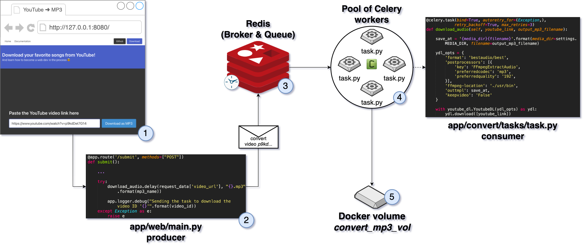

# Disclaimer <!-- {docsify-ignore} -->

**This documentation is a work in progress**

---
# Converting the Video Using Celery <!-- {docsify-ignore} -->

We talked briefly about celery in [Download the MP3 file](/app/download-mp3.md) section about *workers*, *pool of workers*, *scheduled tasks*, etc.

We are now going to dive a little bit deeper into the **Celery** world since it's something that you are going to be using a lot. 

Even if you don't use **Celery**, the same concepts will apply to other libraries and to the idea on how to build scalable systems.

## The procastination way

When you're working with medium/long process tasks like extracting a video audio to store it into an audio file, you don't want to do it in a *synchronic way* or *right away*.

To better understand this let's analyse our app flow:

1. The user send us a YouTube URL
2. The back run some validations
3. The back converts the video into an mp3 file

One of the most important thing while developing apps is to avoid *locking* the user into a screen after clicking on something.

You already see this every day in others apps. When you upload a video to any platform, you only get *locked* in the same screen while the video is being uploaded from your computer to the server.

This is because a file transfer is being made and can't be aborted in order to continue.

But once the file has been uploaded to the server, you can keep on using the platform as usual and will get notified when the video is ready or published.

This is an *asynchronous* process. Meaning that you no longer need to wait for something to finish to do something else.

The way to design this processes is by using a *broker* a *queue* to process *tasks*.

There's a few components to analyse

1. **Producers** apps/systems that generate requests for tasks
2. **Consumers** functions that process those tasks 
3. **Broker** a system that receives *messages* and *routes* those messages into *queues*
4. **Queues** a system that *store* the *messages* that will be sent to the *consumers* by the queue. In this case the *consumers* could ask for messages when they are free, or the **queue** could *push* the message on [*pub/sub* pattern](https://ably.com/blog/pub-sub-pattern-examples) (in the pub/sub pattern *consumers* are named *subscribers*)

## Flow diagram

This is the flow that our app follows to convert the video into an mp3

1. The user enters the **YouTube URL** and clicks **Download as MP3**
2. The **YouTube URL** is sent to the *backend* where our *producer* talks to **Celery** (using the *download.delay(...)* command) to schedule the task.
3. That *scheduling* procedure sends a *message* to **Redis**, that act as a *Broker and Message Queue* at the same time, and stays there waiting.
4. When one of the workers in the *pool* it's free, meaning it's not doing anything, it will automatically ask to the *queue* if there's any new messages and start processing our newly message.  
  1. We use the tool [youtube-dl](https://github.com/ytdl-org/youtube-dl) to convert the video to MP3
5. The worker run the task and saves the MP3 to the *convert\_mp3\_vol* volume defined in our *docker-compose.yaml*

