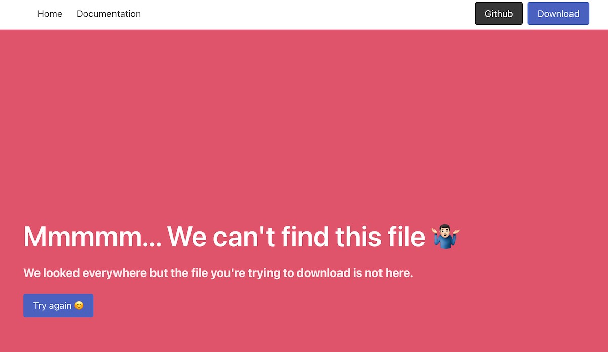

# DISCLAIMER

**This document is a work in progress and I'll be building the tutorial for all the pieces in the coming weeks along with some modifications.**

--- 

# Download the MP3 file

The process that converts the video into an MP3 file is done using a **Celery Task** and as we mentioned in other parts of the documentation, this **Task** runs asynchronously. This means that when the user opens the **URL** generated, after clicking on the **Download MP3** button, the file might not be ready yet.

Start by opening the file at `app/web/main.py` and find these lines

```
@app.route('/download-music/<video_to_mp3_id>', methods=["GET"])
def download(video_to_mp3_id):
```

You can see that the *route* decorator here has a new format compared to other ones.

This is why in this case we want to be able to *receive* the name of the mp3 file that was generated after the user clicked the **Convert to MP3** button on the site.


### 1 User asks for the file

As mentioned above, this endpoint is the one the user will use to download the MP3 file, and the name of the file has been already created.

### 2 Is the MP3 name valid

To generate the name of the MP3 we use a [UUID](https://en.wikipedia.org/wiki/Universally_unique_identifier)

!> A universally unique identifier is a 128-bit label used for information in computer systems. The term globally unique identifier is also used. When generated according to the standard methods, UUIDs are, for practical purposes, unique

This is a good practice if you want to prevent naming collision (which means having duplicated filenames).

**UUID** values have a well-defined mask. This means that we can validate that only valid UUID types of *strings* are requested. 

If someone tries to access this endpoint using something like:

- https://127.0.0.1:8080/download-music/mysuperfile
- https://127.0.0.1:8080/download-music/songname.mp3
- https://127.0.0.1:8080/download-music/IwillHackYou
- ....

We can evaluate those *mp3 names* (mysuperfile, songname.mp3, IwillHackYou) and know that are not valid **UUID** type of strings and jump to **3**.

Otherwise, we can jump to **4**

### 3 Return invalid.html response

We show the **invalid.html** page located at `app/web/templates/invalid.html`



Notice that the code doesn't even try to locate the file. We already know that this is not valid.

### 4 Check the Cache Layer

Every time we schedule a **Celery Task** to convert the **YouTube** video into an MP3 file we add a new record into our cache layer. This way we can check if the **UUID** (name of the mp3 file) belongs to a file that we are currently processing, or have processed.

!> This record on **Redis** has a TTL (time to live) value since we are not going to be storing the mp3 file forever.  
We talked about that in the section [Receiving the YouTube Link](docs/app/receiving-the-youtube-link.md)

If the **UUID** is not present it means that, either the file has been deleted or never existed.

!> Remember, we use the **UUID** string as the key in our cache layer

Now, if the key doesn't exist we jump to **5**. If it does, we jump to **6**

### 5 Return invalid.html response

As we mentioned in **4**, if we jumped here it means that the key doesn't exist. So we show the **invalid.html** page located at `app/web/templates/invalid.html`


### 6 Task Finish

Remember that we asynchronously process our video using a **Celery Task**. This means that the *task* could be waiting for a *worker* to be free to start converting the video into MP3.

Or maybe the video is being converted when the user makes the request.

> A *worker* is a process that executes a pre-defined function and it's triggered when a new *task* is given to it.  
> Our pre-defined function is the one at `app/convert/tasks/task.py` and the function name
> 
> ```
> @celery.task(bind=True,  
> 		autoretry_for=(Exception,),  
> 		retry_backoff=True,
> 		max_retries=3)  
> def download_audio(self, youtube_link, output_mp3_filename):  
>   
>    save_at = '{media_dir}{filename}'.format(media_dir=settings.MEDIA_DIR, filename=output_mp3_filename)
> ...
> ```

But, how do we know this?? We explained that at [Receiving the YouTube Link](docs/app/receiving-the-youtube-link.md)

So we can check ask our cache layer, **Redis**, to give us the content stored in the key with the name of the **UUID** (name of mp3) and it will return two possible values: `ONQUEUE` or `FINISH`

If the value returned is `ONQUEUE` then we jump to **7**, or **8** if it's `FINISH`

### 7 Return not_ready.html response

We tell the user that we're still converting the video


### 8 File exists in volume

Let's start with the basics. What a hell is a volume????

In your docker-compose file `docker/docker-compose.yml` we have defined two volumes

```
volumes:
  converted_mp3_vol:
    external: true
  redis_vol:
    external: true
```

A *volume* is like a hard drive that we can use to preserve our information. This is useful because the storage of the containers is not persistent. This means that if the container crashes or gets shut down, any information that you stored on it will be lost.

We can attach/link volumes to containers. In our project, we attach the volume **converted_mp3** to two of our containers: web and celery_workers.

This way every time we create a new mp3 file we store it inside the volume. That way we can be sure that if anything goes wrong, we still have the converted mp3 safely stored.

Now that you know a bit more about volumes, we can move forward.

At this stage of the code, we know that the file should exist, but we also know that sometimes things fail. So before trying to send a file, we need to make sure it exists.

If the file exists in the volume, we jump to **10**, or **9** if we can't find it.

### 9 Return invalid.html response

We know that the file is not present in our volume, so we return **invalid.html** page located at `app/web/templates/invalid.html`


### 10 Send file

We've found the file, so we send it to the user

```
return send_from_directory(settings.MEDIA_DIR, mp3_filename)
```