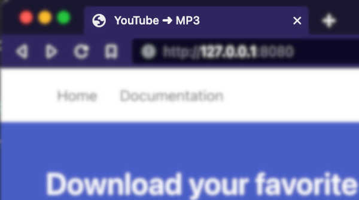
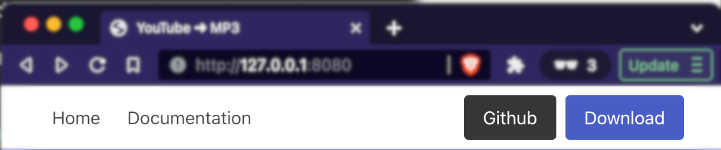
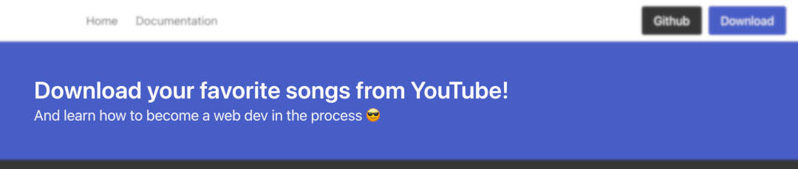
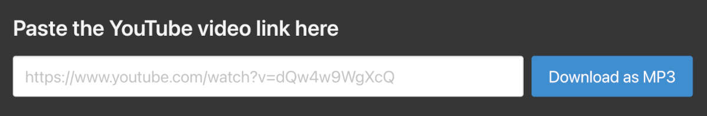
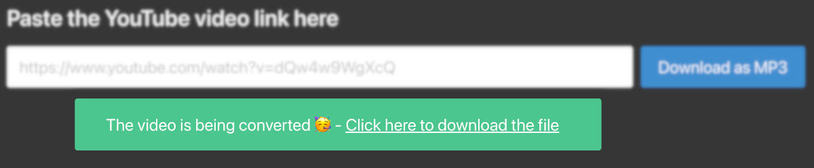
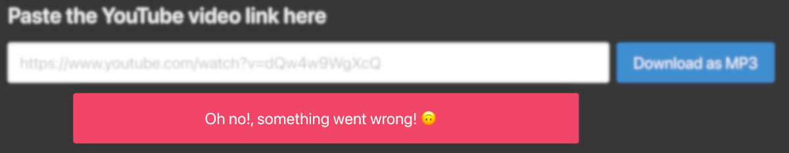
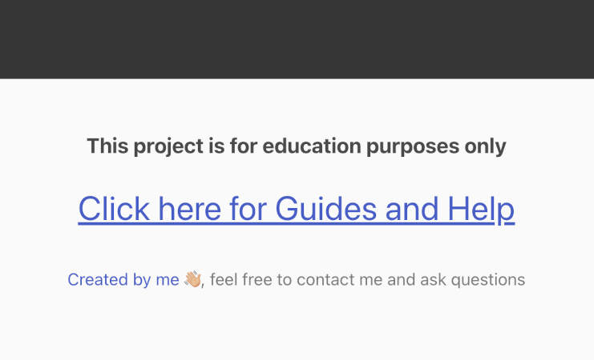
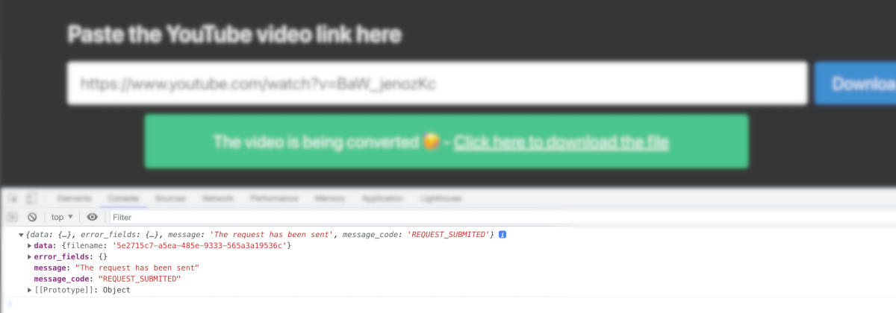

# The Frontend

The frontend is what the user sees and is built using HTML, CSS, and Javascript.

> If you're new to HTML, CSS, and Javascript:  
>
> [https://developer.mozilla.org/en-US/docs/Learn/HTML/Introduction_to_HTML](https://developer.mozilla.org/en-US/docs/Learn/HTML/Introduction_to_HTML)  
> [https://developer.mozilla.org/en-US/docs/Learn/CSS](https://developer.mozilla.org/en-US/docs/Learn/CSS)  
> [https://developer.mozilla.org/en-US/docs/Learn/JavaScript](https://developer.mozilla.org/en-US/docs/Learn/JavaScript)

In our case we're using a CSS Framework, called [Bulma](https://bulma.io/documentation/).

> A CSS framework is a library allowing for easier, more standards-compliant web design using the Cascading Style Sheets language. Most of these frameworks contain at least a grid. More functional frameworks also come with more features and additional JavaScript based functions, but are mostly design oriented and focused around interactive UI patterns.
>   
> Source: https://en.wikipedia.org/wiki/CSS_framework

What I like about **Bulma** is that it's a nice choice for people that are getting started because of it simplicity and good documentation.

Once you understand the basics behind one CSS Framework, you can easily jump into a new one.

!> In a nutshell: A CSS Framework provides predefined *CSS classes* that helps you build your web page (look and feel). These **classes** are CSS definitions that you can use together to: Create buttons, notifications, different layouts and so on.

I recommend that you start by skimming the docs to have a rough idea of what's all about: [https://bulma.io/documentation/overview/start/](https://bulma.io/documentation/overview/start/)

## Landing Page (index.html)

All the code for the frontend is located at `app/web/`.

Open the file at `app/web/templates/index.html` with your favorite code editor.

!> If you don't have a code editor, [Visual Studio Code](https://code.visualstudio.com/docs/introvideos/basics) it's a good, and free, tool to use.

This is the *main page* of our application, where our users can paste a **youtube link** and send it to our backend to be converted into an mp3.

To better understand it, let's start by analyzing each section in this file.

## Head Section

```
<!DOCTYPE html>
<html>
  <head>
    <meta charset="utf-8">
    <meta name="viewport" content="width=device-width, initial-scale=1">
	 <title>YouTube ➜ MP3</title>
    <link rel="stylesheet" href="https://cdn.jsdelivr.net/npm/bulma@0.9.4/css/bulma.min.css">
  </head>
  <body>
```

A standard HTML head section. The most relevant parts here are the **title** and **link** tags

`<title>YouTube ➜ MP3</title>`  
This is what you see in your browser tab when you open the tab



`<link rel="stylesheet" href="https://cdn.jsdelivr.net/npm/bulma@0.9.4/css/bulma.min.css">`  
This tells the browser to load **Bulma CSS Framework** when the page is open.

!> You don't need to have **Bulma** in your computer/server to use it, you can *serve it* directly from their CDN Service
 
> What's a CDN?  
> A content delivery network (CDN) refers to a geographically distributed group of servers which work together to provide fast delivery of Internet content.
> 
> A CDN allows for the quick transfer of assets needed for loading Internet content including HTML pages, javascript files, stylesheets, images, and videos. The popularity of CDN services continues to grow, and today the majority of web traffic is served through CDNs, including traffic from major sites like Facebook, Netflix, and Amazon.  
> 
> Source: https://www.cloudflare.com/learning/cdn/what-is-a-cdn/


## Navigation Bar

```
<nav class="navbar">
  <div class="container">
    <div id="navMenu" class="navbar-menu">
      <div class="navbar-start">
        <a class="navbar-item">
          Home
        </a>
        <a class="navbar-item">
          Documentation
        </a>
      </div>

      <div class="navbar-end">
        <div class="navbar-item">
          <div class="buttons">
            <a class="button is-dark" href="https://github.com/gdi3d/learning-to-build">Github</a>
            <a class="button is-link" href="https://github.com/gdi3d/learning-to-build/archive/refs/heads/main.zip">Download</a>
          </div>
        </div>
      </div>
    </div>
  </div>
</nav>
```  



This is a fairly common navigation component. You can do a lot of customization if you need to.

**But, how do you know where to get this code?** That's simple, you just need to look at **Bulma** docs: [https://bulma.io/documentation/components/navbar/](https://bulma.io/documentation/components/navbar/)

Just look for the one you need, and copy and paste it into your web code.

## Hero Component

```
<section class="hero is-link">
  <div class="hero-body">
    <p class="title">
      Download your favorite songs from YouTube!
    </p>
    <p class="subtitle">
      And learn how to become a web dev in the process 😎
    </p>
  </div>
</section>
```  



This is a layout from **Bulma** called *Hero*. Here are the docs: [https://bulma.io/documentation/layout/hero/](https://bulma.io/documentation/layout/hero/)

Again, you can look through the examples and options and just copy and paste what you need.

You can start seeing a pattern here, you can build a lot of stuff by just copying and pasting. It's all about **the building blocks** like a Lego. You just need to choose the pieces and colors to build your own cool project.

!> The names of components, layouts, and other building blocks are the same in every CSS framework.

## Main section

```
<section class="section is-large has-background-dark">
  <h1 class="title has-text-white-ter">Paste the YouTube video link here</h1>
  <div>
    <div class="field is-grouped">
      <p class="control is-expanded">
        <input class="input is-large" name="video_url" type="text" placeholder="https://www.youtube.com/watch?v=dQw4w9WgXcQ">
      </p>
      <p class="control">
        <button class="button is-info is-large" id="convert">
          Download as MP3
        </button>
      </p>
    </div>
  </div>
  
  <div class="columns mt-1 is-hidden" id="convert_success">
    <div class="column is-8 has-text-centered is-offset-1">
      <div class="notification is-success">
        <p class="is-size-4">The video is being converted 🥳 &dash; <a id="mp3_download_link">Click here to download the file</a></p>
      </div>
    </div>
  </div>

  <div class="columns mt-1 is-hidden" id="convert_error">
    <div class="column is-8 has-text-centered is-offset-1">
      <div class="notification is-danger">
        <p class="is-size-4">Oh no!, something went wrong! 🙃</p>
      </div>
    </div>
  </div>

</section>
```
Here's where our user is going to paste the YouTube URL that wants to convert into an **MP3**.

There are a few things to unpack here, but again, everything has been copied and pasted from **Bulma** with minor modifications.

```
<section class="section is-large has-background-dark">
....
</section>
```

The section **layout** is the one named **Large** in **Bulma** docs: [https://bulma.io/documentation/layout/section/](https://bulma.io/documentation/layout/section/), and you can tell by looking at one of the *classes* in the **class** attribute: `class="section is-large has-background-dark"`, the one that's named `is-large` indicates the height of the *section*

> What's a section???
> 
> The \<section\> HTML element represents a generic standalone section of a document, which doesn't have a more specific semantic element to represent it. Sections should always have a heading, with very few exceptions.
> 
> Source: https://developer.mozilla.org/en-US/docs/Web/HTML/Element/section

Inside the **section** we have the input field and a button.

```
<div>
  <div class="field is-grouped">
    <p class="control is-expanded">
      <input class="input is-large" name="video_url" type="text" placeholder="https://www.youtube.com/watch?v=dQw4w9WgXcQ">
    </p>
    <p class="control">
      <button class="button is-info is-large" id="convert">
        Download as MP3
      </button>
    </p>
  </div>
</div>
```



You can see that the input and button were taken from: [https://bulma.io/documentation/form/general/#form-group](https://bulma.io/documentation/form/general/#form-group) (the 4th example)

And then two *hidden* elements. You can tell they are hidden because one of the *classes* in the *class* attribute is named **is-hidden**

The success notification
```
<div class="columns mt-1 is-hidden" id="convert_success">
  <div class="column is-8 has-text-centered is-offset-1">
    <div class="notification is-success">
      <p class="is-size-4">The video is being converted 🥳 &dash; <a id="mp3_download_link">Click here to download the file</a></p>
    </div>
  </div>
</div>
```



And the error notification

```
<div class="columns mt-1 is-hidden" id="convert_error">
  <div class="column is-8 has-text-centered is-offset-1">
    <div class="notification is-danger">
      <p class="is-size-4">Oh no!, something went wrong! 🙃</p>
    </div>
  </div>
</div>
```



You might have notices the following *classes* already:

1. [columns](https://bulma.io/documentation/columns/basics/)
2. [mt-1](https://bulma.io/documentation/helpers/spacing-helpers/#list-of-all-spacing-helpers)
3. [is-hidden](https://bulma.io/documentation/helpers/visibility-helpers/#other-visibility-helpers)
4. [has-text-centered](https://bulma.io/documentation/helpers/typography-helpers/#alignment)
5. [is-offset-1](https://bulma.io/documentation/columns/sizes/#offset)

Go ahead and read the docs for them to learn more about them.

## Footer

This is the last part of the web, and as you might be thinking, it's yet another type of layout in **Bulma**: [https://bulma.io/documentation/layout/footer/](https://bulma.io/documentation/layout/footer/)

```
<footer class="footer">
  <div class="content has-text-centered">
    <p class="is-size-5 has-text-weight-bold">
      This project is for education purposes only
    </p>
    <p class="is-size-3">
      <a href="https://github.com/gdi3d/learning-to-build" target="_blank" class="is-underlined">Click here for Guides and Help</a>
    </p>
    <p class="has-text-grey"><a href="https://www.linkedin.com/in/adrianogalello" target="_blank" >Created by me 👋🏼</a>, feel free to contact me and ask questions</p>
  </div>
</footer>
```



## Javascript

This is where we connect our frontend (what the user see and interact with) with our backend (where all the magic happens)

```
# Inside app/web/templates/index.html

<script src="/static/js/main.js"></script>
```

If you open the file at  `app/web/static/js/main.js` you'll see this:

```
document.getElementById("convert").addEventListener("click", function(e) {
  
  const data = { video_url:  document.getElementsByName('video_url')[0].value };

  fetch('http://127.0.0.1:8080/submit', {
    method: 'POST',
    headers: {
      'Content-Type': 'application/json',
    },
    body: JSON.stringify(data),
  })
  .then(response => {
    if (!response.ok) {
      throw new Error(`The endpoint returned an error: ${response.status} ${response.statusText}`);
    }
    return response.json();
  })
  .then(data => {
    console.log(data);
    document.getElementById('convert_error').classList.add('is-hidden');
    document.getElementById('convert_success').classList.remove('is-hidden');
    document.getElementById('mp3_download_link').setAttribute('href', `/download-music/${data.data.filename}`);
  })
  .catch((error) => {
    console.error(error);
    document.getElementById('convert_success').classList.add('is-hidden');
    document.getElementById('convert_error').classList.remove('is-hidden');
  });
});
```

Let's jump into the code line by line.

```
document.getElementById("convert").addEventListener("click", function(e) {
....
```
**document.getElementById** tells javascript: Find inside the document *(the web page)* an element *(a tag)* where the attribute **id** is equal to **convert**.

In your case, that element is the button that we already saw in the [main section analysis](#main-section):

```
<button class="button is-info is-large" id="convert">
  Download as MP3
</button>
```

!> There can not be two or more elements with the same id value!

The next part `addEventListener("click", function(e) {...` tells javascript to add an event listener that *listen* to the **click** event and then execute some function.

!> In a nutshell: Whenever this button with the id=convert is clicked, execute the following function.

Now let's go over the function

```
const data = { video_url:  document.getElementsByName('video_url')[0].value };
```

We need to send to our backend what's the YouTube link that the user wants to download.

This line assigns creates an object with a property *video_url* and sets it's value *(the YouTube link that the user wants)* by reading the content of the input text named **video_url**

```
<input class="input is-large" name="video_url" type="text">
```

Notice the property **name** here, and notice that we can access this element using `document.getElementsByName`.

!> Contrary to **id's** attributes, there can be more than one element with the same name value. And that's the reason we use [0] (it indicates the first match)

Now that we have the YouTube URL that the user wants to convert to mp3, we need to send it to the backend

```
fetch('http://127.0.0.1:8080/submit', {
    method: 'POST',
    headers: {
      'Content-Type': 'application/json',
    },
    body: JSON.stringify(data),
  })
```

We're using the *fetch* function of javascript to send our data to the backend. 

I highly recommend that you read the following doc to understand better what this does [https://developer.mozilla.org/en-US/docs/Web/API/Fetch_API/Using_Fetch](https://developer.mozilla.org/en-US/docs/Web/API/Fetch_API/Using_Fetch)

When the backend responds to our request, we need to see what the response was

```
.then(response => {
    if (!response.ok) {
      throw new Error(`The endpoint returned an error: ${response.status} ${response.statusText}`);
    }
    return response.json();
  })
```

If the `response.ok` is not **true**, then we send an error, otherwise, we process the response with `response.json()`

As you can see, from this point on, we can take two paths. An error is present (invalid YouTube Link for example) or everything went smooth.

If everything went ok, the code jumps to this part

```
.then(data => {
    console.log(data);
    document.getElementById('convert_error').classList.add('is-hidden');
    document.getElementById('convert_success').classList.remove('is-hidden');
    document.getElementById('mp3_download_link').setAttribute('href', `/download-music/${data.data.filename}`);
  })
```
 
 This part of the code does three things:
 
 1. Shows the data responded by the backend in the [javascript console](https://developer.chrome.com/docs/devtools/open/) `console.log(data)`

    

2. This is just for **debugging** purposes, that line will be removed in a production environment.
3. The following two lines show and hide the notification component
 
  ```
  document.getElementById('convert_error').classList.add('is-hidden');
  document.getElementById('convert_success').classList.remove('is-hidden');
  ```
  Why hide the error if it's already hidden in the initial state of the web page? Well, that's because the user might try an invalid URL first, causing the error to show up. So we need to make sure that in case of success the error notifications gets hide.
  
4. And finally, we need to tell the user where to download his converted video
  
  ```
  document.getElementById('mp3_download_link').setAttribute('href', `/download-music/${data.data.filename}`);
  ```
  Here we're creating the **link** with the data returned by our backend
  
The last part of the code is just to show an error

```
.catch((error) => {
    console.error(error);
    document.getElementById('convert_success').classList.add('is-hidden');
    document.getElementById('convert_error').classList.remove('is-hidden');
  });
```

As you can see, the code is quite similar to the successful one. But in this case, we hide the success notification and show the error one.

But what's http://127.0.0.1:8080 ??

**127.0.0.1** it's the **local ip** address of your computer (A.K.A localhost), and **8080** it's the port where the connection is made.

Of course this IP would be replaced by a domain name or another IP when you deploy it on your server. But for now we're only working on our **localhost**