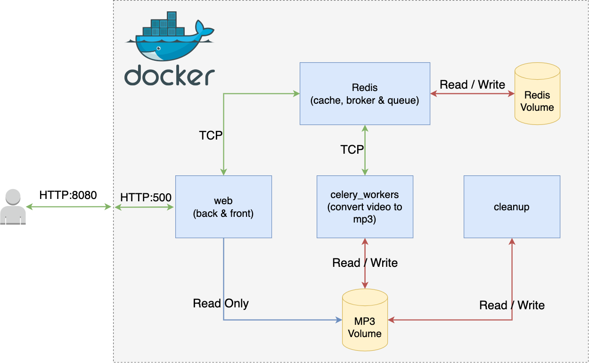

# DISCLAIMER <!-- {docsify-ignore} -->

This documentation is a work in progress

---

# Architecture <!-- {docsify-ignore} -->

The project is designed using **microservices**. 

The Microservices architectures pattern proposes that you decompose your application into small systems. These systems will be:

- Highly maintainable and testable
- Loosely coupled
- Independently deployable
- Organized around business capabilities
- Owned by a small team

It's the opposite of a **Monolithic** where all of your applications live inside a single system.

!> Learn more about microservices at [https://microservices.io/index.html](https://microservices.io/index.html)

When using **microservices** we refer to the small systems as **services**.

These **services** can be composed of one or more containers.

A **container** (run by Docker) is what you **deploy/launch** to make your software run.

!> More about Docker containers: [https://www.docker.com/resources/what-container/](https://www.docker.com/resources/what-container/)

!> Docker it's just one flavor of containers, there are other container engines available: [CoreOS rkt](https://github.com/rkt/rkt), [runC](https://github.com/opencontainers/runc), [containerd](https://containerd.io/docs/), [podman](https://podman.io/), [lxc](https://github.com/lxc/lxc) ...

## Docker-Compose

To deploy our **stack** of services, we're using **docker-compose**

> Compose is a tool for defining and running multi-container Docker applications. With Compose, you use a YAML file to configure your application’s services. Then, with a single command, you create and start all the services from your configuration  
> 
> Source: [https://docs.docker.com/compose/](https://docs.docker.com/compose/)

When you're working with **microservices**, it's probably that you'll end up running more than 2 *services*. Those *services* will need to be able to receive configuration parameters, talk to other *services*, share volumes, and a lot of other stuff.

The best way to handle all of these configurations is to use *docker-compose*. Otherwise, you'll have to type a lot of commands in the console every time you want to start/stop a *service*, change ports, env variables, etc.

!> docker-compose is used mostly in dev environments. For a production environment, you'll be using something like [Kuberentes](https://kubernetes.io/docs/home/) or [Docker Swarm](https://docs.docker.com/engine/swarm/) among others

## The stack

This is what our `docker/docker-compose.yml` defines:



If you look at the diagram above, you can see 4 *services* defined:

1. web
2. celery_workers
3. cleanup
4. redis

!> A *Service* refers to a particular component

Start by opening the file at `docker/docker-compose.yml`

## Web Service

This service runs the frontend & backend of our application.

**docker-compose definition**

```
web:
    image: youtubemp3_web:latest
    restart: on-failure
    ports:
      - "8080:5000"
    volumes:
      - converted_mp3_vol:/data:ro 
    depends_on:
      - redis
    environment:
      - PYTHONPATH=/app
      - FLASK_APP=web.main
      - FLASK_ENV=development
    command: ["flask", "run", "--host=0.0.0.0"]
```

!> For the general documentation you can check [https://docs.docker.com/compose/compose-file/](https://docs.docker.com/compose/compose-file/).

`web` Is the name that we give our service. It's important because *docker-compose* will transform this into a [DNS Record](https://gdi3d.github.io/how-to-connect-docker-containers-2021-07-26/) that will allow us to call the service by using that name. (Read the link for more about this)

`image` Points to the docker image that will be used for launching the containers for this service. The instruction for building the image are covered in the [How To Install It](/README?id=how-to-install-it) section  

> [docker compose docs](https://docs.docker.com/compose/compose-file/#image) for `image` command

`restart: on-failure` Indicates that in case a *container* fails, it should be restarted 

> [docker compose docs](https://docs.docker.com/compose/compose-file/#restart) for `restart` command

`ports` Allows you to do a port forwarding between your localhost and the container. In our case, when the user opens http://127.0.0.1:8080/ to make a request, that request will be sent to port **5000** in our web container. And that's because the command `flask run --host....` (below) will launch the process and start listening on the port **5000**.

> [docker compose docs](https://docs.docker.com/compose/compose-file/#ports) for `ports` command

`volumes` This is where we attach the *volume* that stores the converted MP3's files. Notice the `:ro` at the end?, that indicates that this volume is only accessible in **READ ONLY** mode since this *service* doesn't need to write anything there

> [docker compose docs](https://docs.docker.com/compose/compose-file/#volumes) for `volumes` command

`depends_on` Tell's docker-compose that our service needs the service *redis* to be created before creating the *web* service.

> [docker compose docs](https://docs.docker.com/compose/compose-file/#depends_on) for `depends_on` command

`environment` Most of the services you create are going to need some form of configuration. These configurations can be set using *environment variables*. For the web service, we need to address these 3.

- PYTHONPATH indicates where our code is.
- FLASK_APP tells Flask (the micro-framework we use to develop the service) where the app is located. It indicates a *PATH* but using dots `.` instead of slashes `/`, (it's a python import actually). So, it's actually `web/main.py`
- FLASK_ENV by setting this to `development` we're enabling the debug mode, which will help us to see what's going on in case of a failure. This should be set to `production` otherwise.

> [docker compose docs](https://docs.docker.com/compose/compose-file/#environment) for `environment` command

`command` The command we want to run when we launch our container. It might look like 3 different commands, but it's just one: `flask run --host=0.0.0.0`.

Notice the `host=0.0.0.0` this indicates that we allow connections from everywhere, otherwise, you won't be able to communicate from our computer to the inside of the container (even with the port forward configuration from above)

> [docker compose docs](https://docs.docker.com/compose/compose-file/#command) for `command` command


## Celery workers

```
celery_workers:
    image: youtubemp3_convert:latest
    restart: on-failure
    deploy:
      replicas: 1
    volumes:
      - converted_mp3_vol:/data
    depends_on:
      - redis
    environment:
      - PYTHONPATH=/app
    command: celery -A convert.tasks.task worker --pool=solo --loglevel=INFO
```

This is the service that runs the **[Pool of Celery Workers](/app/converting-youtube-video-to-mp3-celery?id=flow-diagram)**.

Notice the `replicas: 1` config?, That means that we only run one (1) worker. You can increment that number depending on the amount of traffic you have on your app.

If you change the number of replicas to, let's say 3, that means that you'll be able to process up to 3 videos at the same time.

But for the *dev environment* this value is enough.

There's also another *special* config set in the *command* line. 

We're using `--pool=solo`. This is kind of an advanced topic on celery. But it tells celery that we're only going to run one worker.

!> Increasing our *replicas* count will launch new containers. That means that `--pool=solo` is still valid because we are going to have only one worker on each of those containers.

## Cleanup

```
cleanup:
    image: youtubemp3_cleanup
    restart: on-failure
    volumes:
      - converted_mp3_vol:/data
```

The cleanup service doesn't have any python on it. It's just a Linux cronjob running inside a container that deletes any MP3 files older than 8 hours. This way we can avoid filling up our disks.

!> If you have a lot of traffic and a lot of videos being converted, you'll have to either use a bigger disk to store your volume or delete files sooner than 8 hours.

## Redis

```
redis:
    image: redis:latest
    ports:
      - "6379:6379"
    volumes:
     - redis_vol:/data

```

Our Cache and Broker & Queue system.


